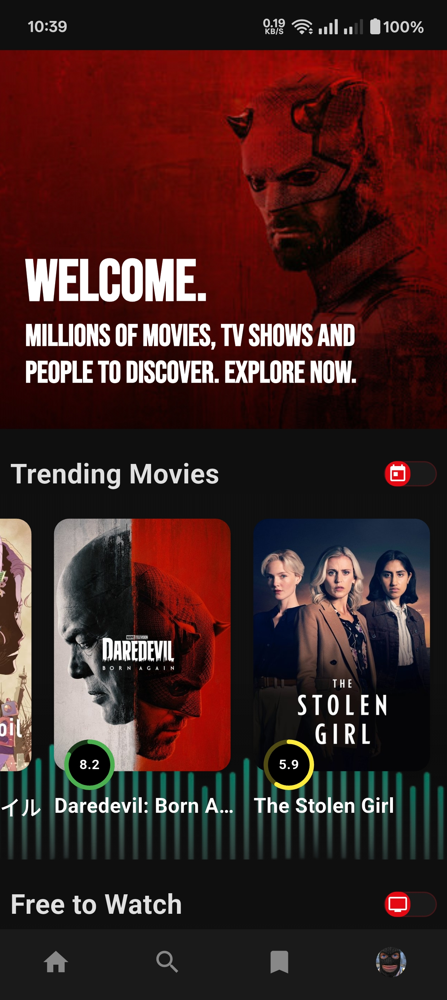
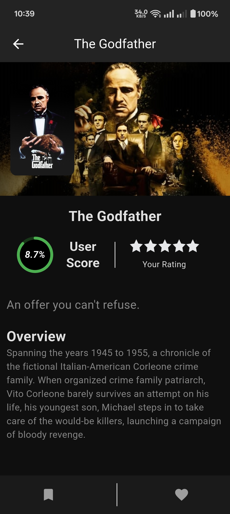
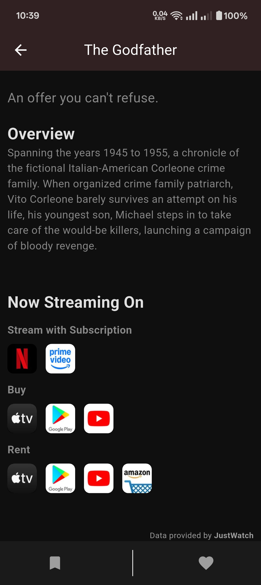

# 🎬 TMDB - Movie & TV Explorer App

TMDB is a beautifully designed Flutter app that allows users to discover and explore movies, TV shows, and people using The Movie Database (TMDB) API. It supports browsing trending content, managing personal watchlists, checking streaming availability, and more. Whether you're a casual viewer or a movie buff, TMDB provides a smooth and feature-rich experience.


---

## 📱 Features

- 🔍 Search and explore trending Movies, TV Shows & People
- 🗂️ Filter content by genres, release dates, ratings, etc.
- 🌟 Add/remove from Watchlist and mark favorites
- 🎞️ Detailed info about each title: overview, cast, ratings, streaming providers
- 🔐 Support for TMDB Guest Login & Account Login
- 🇮🇳 Watch Providers in your region (IN) with logos & direct links
- 🌓 Dark mode support
- 🔄 Smooth animations and UI transitions
- 🧪 Built with clean architecture using GetX & Dio

---

## 📸 Screenshots

| Home                              | Movie Detail                         | Watch Providers                        |
|-----------------------------------|--------------------------------------|----------------------------------------|
|  |  |  |

---

## ⚙️ Tech Stack

- **Flutter 3.29.2**
- **Dart 3.7.2**
- **GetX** for state management
- **Dio** for networking
- **SharedPreferences** for session management
- **AppLinks** for deep linking
- **Hive** (optional for local storage)

---

## 🚀 Getting Started

### 1. Clone the repository

```bash
git clone https://github.com/Groot26/TMDB.git
cd TMDB
